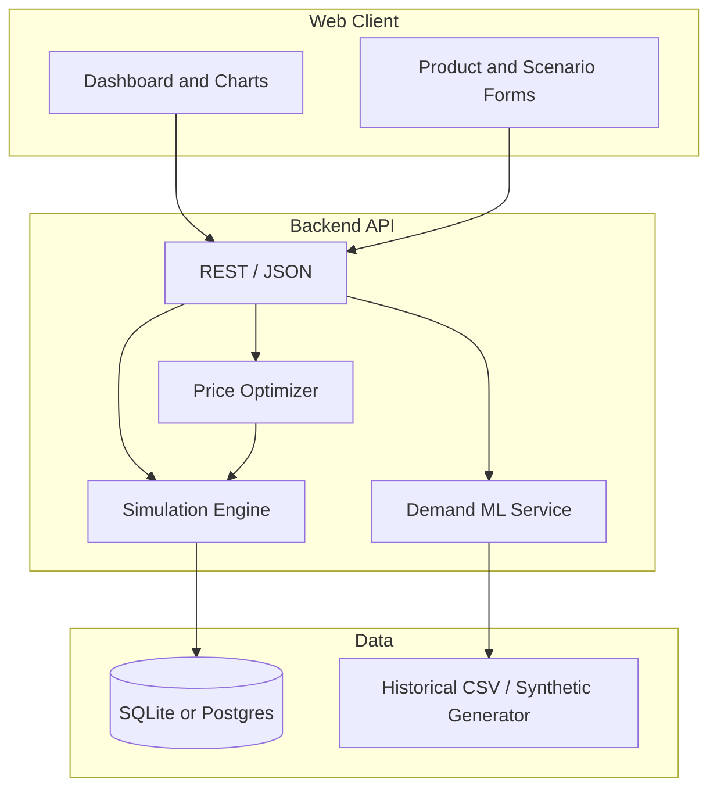

# AI-Powered Price Simulator — Project Scope

## 1. Elevator pitch

**Smart Pricing Lab** is a web application that lets users simulate how pricing decisions affect demand, revenue, and profit for a small product catalog. Classical economics models drive the simulation; machine learning augments forecasting and recommendations; optional LLM features explain results in plain language.

The name *AI-powered* is intentional: AI is used where it adds value (demand prediction from features, anomaly detection on sales history, natural-language what-if questions)—not as a black box that replaces understandable pricing logic.

**Target audience for the demo:** course instructors, project reviewers, and users playing the role of a boutique retailer or SaaS founder tuning prices.

---

## 2. Problem statement

Pricing is hard: too high kills volume, too low erodes margin, and competitor moves shift the curve. Spreadsheets break down when you want to explore many scenarios quickly or combine elasticity, seasonality, and promotions.

This project delivers a **repeatable simulator** with:

- Transparent formulas (reviewers can verify behavior).
- **What-if** sliders and scenario comparison.
- **AI-assisted** forecasts and recommendations with confidence bounds.
- Exportable results for reports and presentations.

---

## 3. Learning objectives (CS project alignment)

| Area | What you demonstrate |
|------|----------------------|
| **Algorithms** | Price optimization (grid search / golden section / simple gradient), Monte Carlo for uncertainty, time-series or regression for demand |
| **Data structures** | Efficient scenario storage, time-indexed sales series, product graph (categories, substitutes) |
| **Software engineering** | Layered architecture, API design, validation, unit + integration tests |
| **AI/ML** | Supervised demand model (scikit-learn), train/eval split, feature importance; optional LLM for explanations only |
| **Systems** | REST API, auth optional, persistence, basic deployment story |
| **UX** | Dashboard, charts, compare-two-scenarios view |

Adjust depth based on team size (solo vs. 3–4 person team) using the tiered scope in §8.

---

## 4. Core use cases

1. **Define catalog** — Add products with cost, base price, category, and optional competitor reference price.
2. **Configure market** — Set elasticity, seasonality multiplier, promo windows, and competitor reaction (static or rule-based).
3. **Run simulation** — For a horizon (e.g. 12 weeks), compute weekly units sold, revenue, profit, and inventory depletion.
4. **Get AI recommendation** — System suggests a price band that maximizes profit subject to min margin and max price change per week.
5. **Compare scenarios** — Side-by-side: “current price” vs. “recommended” vs. user custom price.
6. **Explain (stretch)** — “Why did profit drop in week 6?” → LLM summarizes simulation outputs (no hallucinated numbers; grounded on API data).

---

## 5. Functional requirements

### 5.1 Must have (MVP)

- User can CRUD products (name, unit cost, current price, category).
- User sets **price elasticity** (ε) per product or category default; demand follows:

  `Q(p) = Q₀ · (p / p₀)^(-ε) · seasonality(t) · promo(t)`

  Document assumptions in the UI tooltip.

- Simulation engine: discrete time steps (weekly), deterministic demand unless “uncertainty mode” enabled.
- Metrics per run: units, revenue, gross profit, margin %, cumulative profit.
- Charts: price vs. units, profit over time, scenario comparison (at least 2 series).
- **ML module (minimal):** Train a regression model on synthetic or CSV historical data `(features → units sold)`; use it to suggest `Q₀` or short-horizon demand adjustment; show MAE/R² on holdout set in an “Model” panel.
- **Optimizer:** Given cost and demand function, find price `p*` maximizing `(p - cost) · Q(p)` with constraints (min/max price, max Δp per period).
- Persist scenarios and last run results (SQLite or PostgreSQL).
- README with setup, architecture diagram, and how AI vs. simulation interact.

### 5.2 Should have

- Import/export scenarios as JSON or CSV.
- Competitor price rule: “match within 5%” or “undercut by $X.”
- Uncertainty mode: ε and Q₀ sampled from distributions → profit confidence interval (Monte Carlo, N runs).
- Authentication (single-user local auth is enough for class).
- Automated tests: simulation golden files, optimizer edge cases, API contract tests.

### 5.3 Could have (differentiators)

- Multi-product basket with **cross-elasticity** (simple 2×2 matrix).
- Reinforcement-learning toy agent (tabular Q-learning) for dynamic pricing in a simulated market—clearly labeled “advanced module.”
- LLM integration: structured prompt with JSON simulation summary → explanation and suggested experiments.
- Public dataset hook (e.g. retail sales sample) instead of purely synthetic data.

### 5.4 Out of scope (for one semester)

- Real-time integration with live Amazon/Shopify APIs.
- Full inventory replenishment ERP.
- Production-grade multi-tenant billing.
- Un audited financial compliance / tax engines.

---

## 6. Non-functional requirements

| Requirement | Target |
|-------------|--------|
| Performance | 52-week, 50-product simulation < 2 s on laptop |
| Correctness | Documented formulas; unit tests for demand and profit |
| Accessibility | Basic keyboard nav, chart labels, color-safe palette |
| Security | No secrets in repo; env vars for API keys; input validation |
| Maintainability | Type hints (Python/TS), linting, CI running tests |

---

## 7. Proposed architecture



**Suggested stack (pick one column and stay consistent):**

| Layer | Option A (Python-heavy) | Option B (JS full-stack) |
|-------|-------------------------|---------------------------|
| Frontend | React + Vite + Recharts | Same |
| Backend | FastAPI | Node + Express or Next.js API routes |
| ML | scikit-learn, pandas | TensorFlow.js or Python microservice |
| DB | SQLite → Postgres | Same |
| Optional LLM | OpenAI-compatible API via backend proxy | Same |

**Repository layout (recommended):**

```
AI-powered-Price-Simulator/
├── docs/
│   └── PROJECT_SCOPE.md          # this file
├── backend/                      # API, simulation, ML
├── frontend/                     # UI
├── data/                         # sample CSV, synthetic generator script
├── tests/
├── README.md
└── .github/workflows/ci.yml
```

---

## 8. Tiered delivery plan

### Phase 0 — Foundation (week 1–2)

- Repo setup, CI, README architecture section.
- Domain models: `Product`, `Scenario`, `SimulationResult`.
- Pure-function simulation module + golden tests (no UI).

**Exit criteria:** `pytest`/`npm test` green; CLI or script runs one scenario and prints weekly profit.

### Phase 1 — MVP (week 3–5)

- REST API for products and run simulation.
- React dashboard: edit product, run, line charts.
- SQLite persistence.

**Exit criteria:** Demo video path: create product → run 12 weeks → see chart.

### Phase 2 — AI layer (week 6–7)

- Synthetic data generator with known ground truth.
- Train demand regressor; expose metrics and “suggested Q₀.”
- Optimizer endpoint + UI “Apply recommendation” button.

**Exit criteria:** Report subsection: model metrics, feature list, limitation (correlation ≠ causation).

### Phase 3 — Polish & presentation (week 8+)

- Scenario compare, export, uncertainty mode (if time).
- Written report: problem, design, evaluation, ethics (pricing fairness note).
- Optional deployment (Render, Fly.io, or class server).

---

## 9. AI design (be explicit for grading)

### 9.1 What is “AI” in this project?

1. **Demand forecasting (required)**  
   Features example: price, day-of-week, category one-hot, promo flag, lagged sales.  
   Model: Ridge regression or Random Forest Regressor.  
