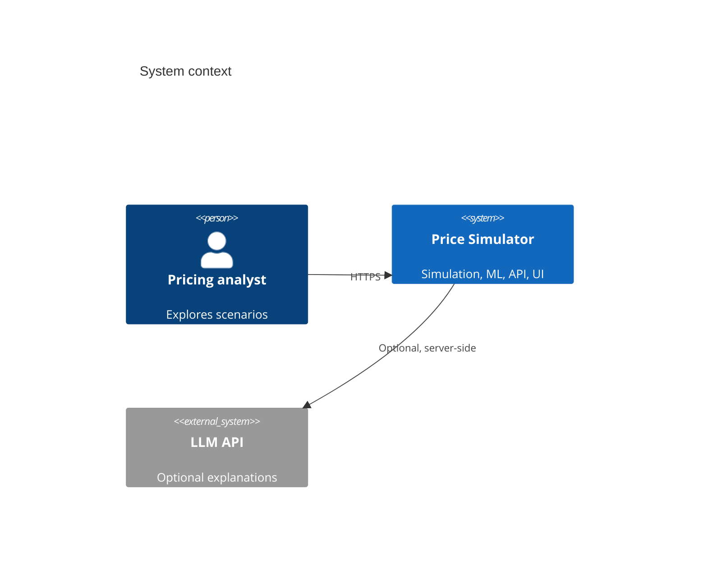

# Technical Specification — AI-Powered Price Simulator

Version: 0.1.0 (draft)  
Status: Pre-implementation  
Primary stack: **FastAPI + Python 3.11**, **React 18 + TypeScript**, **SQLite** (dev) / **PostgreSQL** (prod)

---

## 1. System context



**Boundary:** All pricing logic and ML training run server-side. The client never holds model weights; it receives predictions and simulation time series only.

---

## 2. Domain model

### 2.1 Entities

| Entity | Identity | Mutable fields | Invariants |
|--------|----------|----------------|------------|
| `Product` | `product_id: UUID` | name, sku, unit_cost, list_price, category_id, elasticity ε | `unit_cost ≥ 0`, `list_price > 0`, `ε > 0` |
| `Category` | `category_id: UUID` | name, default_ε | `default_ε > 0` |
| `Scenario` | `scenario_id: UUID` | name, horizon_weeks, products[], market_config | `horizon_weeks ∈ [1, 104]` |
| `MarketConfig` | embedded in scenario | seasonality_curve, promos[], competitor_rule | promo windows non-overlapping per product |
| `SimulationRun` | `run_id: UUID` | scenario snapshot, seed, results[] | immutable after `status=completed` |
| `DemandModel` | `model_id: UUID` | artifact path, metrics, feature_schema_version | trained only on server |

### 2.2 Value objects

```python
# Canonical types (Python); mirror in TypeScript via OpenAPI codegen

@dataclass(frozen=True)
class Money:
    amount: Decimal  # quantized to 4 dp internally, 2 dp in API JSON

@dataclass(frozen=True)
class WeeklyPoint:
    week_index: int  # 0-based
    price: Money
    quantity: float
    revenue: Money
    gross_profit: Money
    margin_ratio: float  # (price - cost) / price
```

---

## 3. Demand and simulation kernel

### 3.1 Constant-elasticity demand (baseline)

For product \(i\) at week \(t\):

\[
Q_i(p, t) = Q_{0,i} \cdot \left(\frac{p}{p_{0,i}}\right)^{-\varepsilon_i} \cdot S_i(t) \cdot M_i(t)
