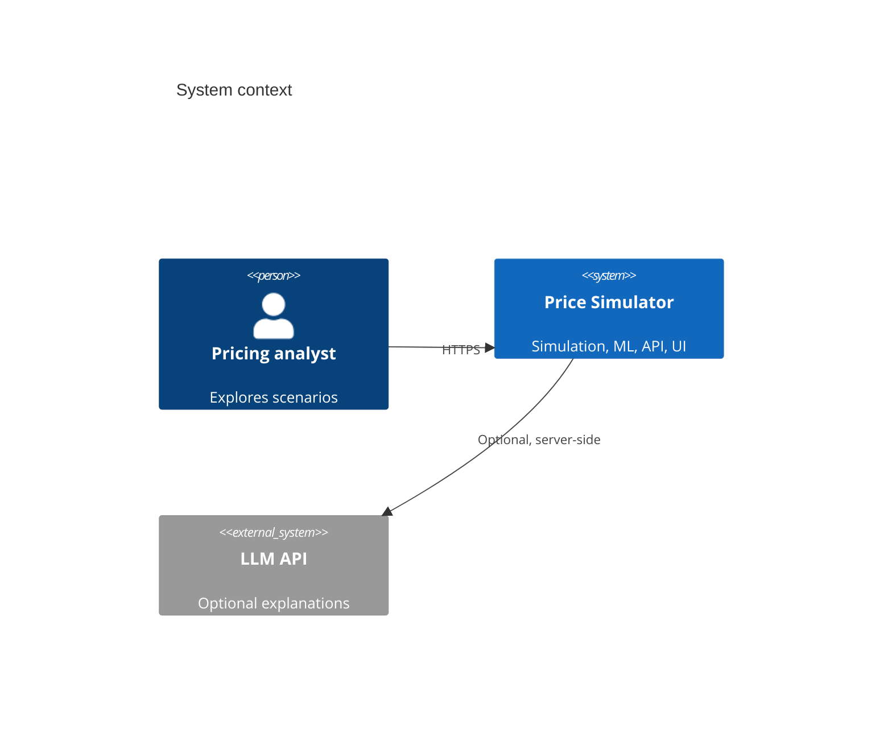

# Technical Specification — AI-Powered Price Simulator

Version: 0.1.0 (draft)  
Status: Pre-implementation  
Primary stack: **FastAPI + Python 3.11**, **React 18 + TypeScript**, **SQLite** (dev) / **PostgreSQL** (prod)

---

## 1. System context



**Boundary:** All pricing logic and ML training run server-side. The client never holds model weights; it receives predictions and simulation time series only.

---

## 2. Domain model

### 2.1 Entities

| Entity | Identity | Mutable fields | Invariants |
|--------|----------|----------------|------------|
| `Product` | `product_id: UUID` | name, sku, unit_cost, list_price, category_id, elasticity ε | `unit_cost ≥ 0`, `list_price > 0`, `ε > 0` |
| `Category` | `category_id: UUID` | name, default_ε | `default_ε > 0` |
| `Scenario` | `scenario_id: UUID` | name, horizon_weeks, products[], market_config | `horizon_weeks ∈ [1, 104]` |
| `MarketConfig` | embedded in scenario | seasonality_curve, promos[], competitor_rule | promo windows non-overlapping per product |
| `SimulationRun` | `run_id: UUID` | scenario snapshot, seed, results[] | immutable after `status=completed` |
| `DemandModel` | `model_id: UUID` | artifact path, metrics, feature_schema_version | trained only on server |

### 2.2 Value objects

```python
# Canonical types (Python); mirror in TypeScript via OpenAPI codegen

@dataclass(frozen=True)
class Money:
    amount: Decimal  # quantized to 4 dp internally, 2 dp in API JSON

@dataclass(frozen=True)
class WeeklyPoint:
    week_index: int  # 0-based
    price: Money
    quantity: float
    revenue: Money
    gross_profit: Money
    margin_ratio: float  # (price - cost) / price
```

---

## 3. Demand and simulation kernel

### 3.1 Constant-elasticity demand (baseline)

For product \(i\) at week \(t\):

\[
Q_i(p, t) = Q_{0,i} \cdot \left(\frac{p}{p_{0,i}}\right)^{-\varepsilon_i} \cdot S_i(t) \cdot M_i(t)
\]

- \(S_i(t)\): seasonality multiplier, piecewise constant or Fourier terms (configurable).
- \(M_i(t)\): promo multiplier (e.g. `0.8` price → effective demand boost via equivalent price reduction).

**Implementation:** pure function `demand_qty(price, params) -> float`; no I/O.

### 3.2 Cross-elasticity (optional module)

CES-lite pairwise adjustment for catalog size ≤ 20:

\[
Q_i \leftarrow Q_i \cdot \prod_{j \neq i} \left(\frac{p_j}{p_{j,0}}\right)^{\gamma_{ij}}
\]

Store \(\gamma_{ij}\) in sparse matrix (CSR) for O(n) updates per week.

### 3.3 Weekly simulation loop

```
INPUT: scenario_snapshot, rng_seed
FOR t IN 0 .. horizon_weeks-1:
  FOR each product i:
    p_i <- pricing_policy(i, t, state)   # user price path or competitor rule
    q_i <- demand_qty(p_i, t, params_i, cross_state)
    q_i <- min(q_i, inventory_i)         # if inventory enabled
    record WeeklyPoint(i, t, p_i, q_i, ...)
    update inventory_i, cumulative profit
OUTPUT: SimulationResult { series: Dict[product_id, List[WeeklyPoint]], aggregates }
```

**Complexity:** \(O(W \cdot P)\) per run; target \(W=52, P=50\) ≪ 1 ms in Python with NumPy vectorization over products per week.

### 3.4 Stochastic mode

Monte Carlo with `N` draws (`N` default 500, cap 5000):

- Sample \(\varepsilon \sim \mathcal{N}(\hat\varepsilon, \sigma_\varepsilon)\), truncate at `ε_min`.
- Sample multiplicative shock \(\eta \sim \text{LogNormal}(0, \sigma_\eta)\) on \(Q_0\).

Report per-week **p10 / p50 / p90** profit across draws. Seed-controlled for reproducibility.

---

## 4. Optimization subsystem

### 4.1 Single-product static optimum (unconstrained)

Maximize \(\pi(p) = (p - c) \cdot Q_0 (p/p_0)^{-\varepsilon}\).

Closed form for \(\varepsilon > 1\):

\[
p^* = c \cdot \frac{\varepsilon}{\varepsilon - 1}
\]

(Validate against numeric optimizer in tests.)

### 4.2 Constrained optimization (production path)

Problem per product:

\[
\max_{p \in [p_{\min}, p_{\max}]} \ (p - c) \cdot Q(p)
\]

Subject to:

- `margin_ratio(p) ≥ m_min`
- `|p - p_{t-1}| ≤ Δ_max` (dynamic pricing path)

**Algorithm:**
